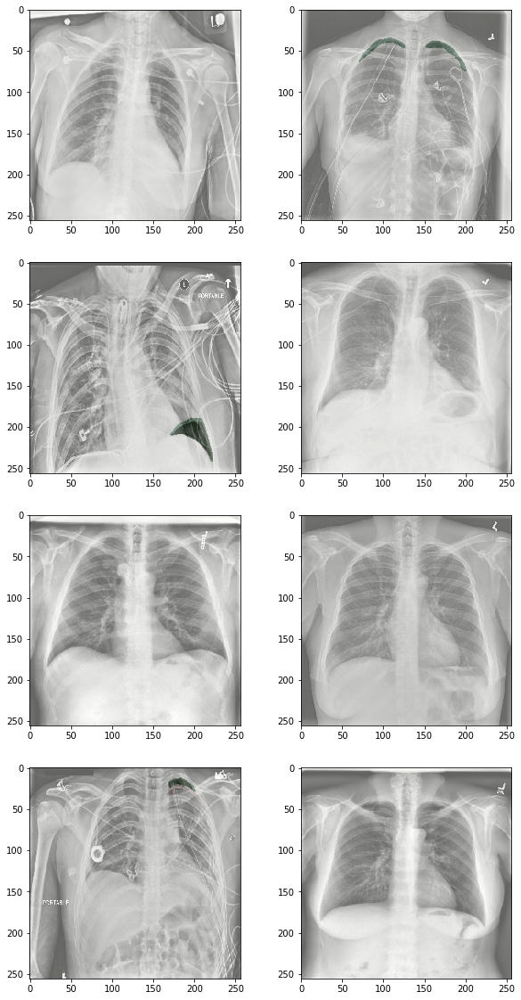

# Kaggle: SIIM-ACR Pneumothorax Segmentation ([link](https://www.kaggle.com/c/siim-acr-pneumothorax-segmentation))

Data: 10 675 chest X-ray images

Task: predict the existence of pneumothorax in an image and indicate the location of the condition

Evaluation: mean Dice Coefficient

Solution: EfficientNet-ResNet U-Net++ (encoder-decoder network with nested, dense skip pathways)

Success: 0.841 mean Dice Coefficient

